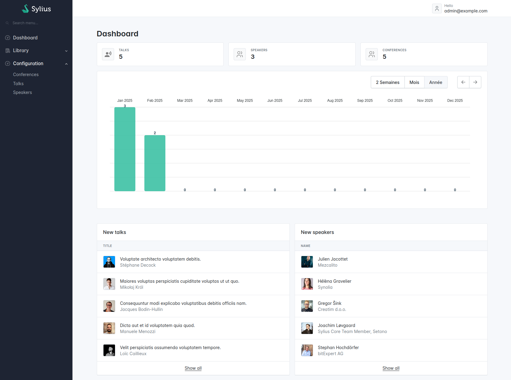

# Sylius Stack Documentation

The Sylius stack is a set of tools for your Symfony projects.
It comes with a bunch of components that work great independently, but when they come together, that's when the stack's magic truly operates!
Indeed, the highlight of this project is the ability to configure an admin panel UI within minutes.

<figure></figure>

⚙️ Installation
---------------

* [Getting started](getting-started.md)

📖 Cookbook
-----------

* [How to customize your admin panel](cookbook/admin_panel.md)
* [How to use in a DDD architecture](cookbook/ddd_architecture.md)

🧩 Components
-------------

* [**AdminUi:** Minimalist generic templates for your admin panels](admin-ui/getting-started.md)
* [**BootstrapAdminUi:** Build your Bootstrap admin panels with Sylius and Symfony UX](bootstrap-admin-ui/getting-started.md)
* [**ResourceBundle:** Resource management system, routing and CRUD operations](resource/index.md)
* [**GridBundle:** Amazing grids with support of filters and custom fields integrated into Symfony](grid/index.md)
* [**TwigExtra:** Additional Twig extensions for your Symfony projects](twig-extra/getting-started.md)
* [**TwigHooks:** Composable Twig layouts](twig-hooks/getting-started.md)
* [**UiTranslations:** Basic UI translations](ui-translations/getting-started.md)
