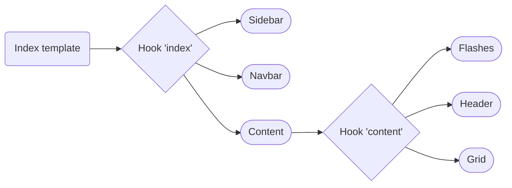

# Getting started

This package lets you set up the content of the [AdminUi package](../admin-ui/getting-started.md) templates.

## Installation

Install the package using Composer and Symfony Flex:

```bash
composer require sylius/bootstrap-admin-ui
```

## Configuring the CRUD templates

CRUD templates are split into configurable blocks.

You can add new blocks, disable existing ones, or reorder them using the [TwigHooks package](../twig-hooks/getting-started.md).

### Create

This package sets up the template content needed to create a new resource.

This adds configurable blocks to the `@SyliusAdminUi/crud/create.html.twig` template.

**Overview of the blocks**


**Overview of the block templates**

```mermaid
flowchart LR
    Template(@SyliusAdminUi/crud/create.html.twig) --> Hook{Hook 'create'}

    Hook --> Sidebar([@SyliusBootstrapAdminUi/shared/crud/common/sidebar.html.twig])
    Hook --> Navbar([@SyliusBootstrapAdminUi/shared/crud/common/navbar.html.twig])
    Hook --> Content([@SyliusBootstrapAdminUi/shared/crud/common/content.html.twig])
```

### Index

This package sets up the template content needed to list resources.

This adds configurable blocks to the `@SyliusAdminUi/crud/index.html.twig` template.

**Overview of the blocks**



### Show

This package sets up the template content needed to show resource details.

This adds configurable blocks to the `@SyliusAdminUi/crud/show.html.twig` template.

**Overview of the blocks**


