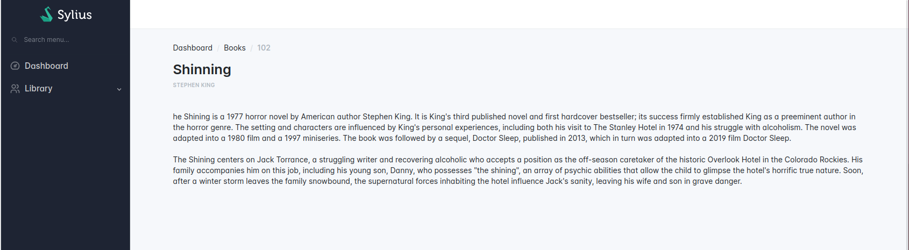

# Basic operations

## List of resources

<div data-full-width="false">

<figure></figure>

</div>

Create a grid for your resource.

```shell
bin/console make:grid
```

Configure the `index` operation in your resource.

```php
namespace App\Entity;

use App\Grid\BookGrid;
use Sylius\Resource\Metadata\AsResource;
use Sylius\Resource\Metadata\Index;
use Sylius\Resource\Model\ResourceInterface;

#[AsResource(
    section: 'admin', // This will influence the route name
    routePrefix: '/admin',
    templatesDir: '@SyliusAdminUi/crud', // This directory contains the generic template for your list
    operations: [
        new Index( // This operation will add "index" operation for the books list
            grid: BookGrid::class, // Use the grid class you have generated in previous step
        ), 
    ],    
)]
class Book implements ResourceInterface
{
    //...
}
```

Use the Symfony `debug:router` command to check the results.

```shell
bin/console debug:router
```

Your route should look like this:

```shell
 ------------------------------ ---------------------------
  Name                           Path                                           
 ------------------------------ ---------------------------                  
  app_admin_book_index           /admin/books               
```

## Resource creation page

<div data-full-width="false">

<figure></figure>

</div>

Create a form type for your resource.

```shell
bin/console make:form
```

Configure the `create` operation in your resource.

```php
namespace App\Entity;

use App\Form\BookType;
use Sylius\Resource\Metadata\AsResource;
use Sylius\Resource\Metadata\Create;
use Sylius\Resource\Model\ResourceInterface;

#[AsResource(
    section: 'admin', // This will influence the route name
    routePrefix: '/admin',
    templatesDir: '@SyliusAdminUi/crud', // This directory contains the generic templates
    formType: BookType::class, // The form type you have generated in previous step
    operations: [
        // ...
        new Create(), // This operation will add "create" operation for the book resource
    ],    
)]
class Book implements ResourceInterface
{
    //...
}
```

Use the Symfony `debug:router` command to check the results.

```shell
bin/console debug:router
```

Your route should look like this:

```shell
 ------------------------------ ---------------------------
  Name                           Path                                           
 ------------------------------ ---------------------------                  
  app_admin_book_create           /admin/books/new               
```

## Resource edition page

<div data-full-width="false">

<figure></figure>

</div>

Ensure you already created the Symfony form type in the [previous section](#resource-creation-page).

Configure the `update` operation in your resource.

```php
namespace App\Entity;

use App\Form\BookType;
use Sylius\Resource\Metadata\AsResource;
use Sylius\Resource\Metadata\Update;
use Sylius\Resource\Model\ResourceInterface;

#[AsResource(
    section: 'admin', // This will influence the route name
    routePrefix: '/admin',
    templatesDir: '@SyliusAdminUi/crud', // This directory contains the generic templates
    formType: BookType::class, // The form type you have generated in previous chapter
    operations: [
        // ...
        new Update(), // This operation will add "update" operation for the book resource
    ],    
)]
class Book implements ResourceInterface
{
    //...
}
```

Use the Symfony `debug:router` command to check the results.

```shell
bin/console debug:router
```

Your route should look like this:

```shell
 ------------------------------ ---------------------------
  Name                           Path                                           
 ------------------------------ ---------------------------                  
  app_admin_book_update           /admin/books/{id}/edit              
```

## Resource details page

<div data-full-width="false">

<figure></figure>

</div>

Configure the `show` operation in your resource.

```php
namespace App\Entity;

use App\Form\BookType;
use Sylius\Resource\Metadata\AsResource;
use Sylius\Resource\Metadata\Show;
use Sylius\Resource\Model\ResourceInterface;

#[AsResource(
    section: 'admin', // This will influence the route name
    routePrefix: '/admin',
    templatesDir: '@SyliusAdminUi/crud', // This directory contains the generic templates
    operations: [
        // ...
        new Show(), // This operation will add "show" operation for the book resource
    ],    
)]
class Book implements ResourceInterface
{
    //...
}
```

Use the Symfony `debug:router` command to check the results.

```shell
bin/console debug:router
```

Your route should look like this:

```shell
 ------------------------------ ---------------------------
  Name                           Path                                           
 ------------------------------ ---------------------------                  
  app_admin_book_show           /admin/books/{id}              
```

```yaml
# config/packages/sylius_bootstrap_admin_ui.yaml
# ...
sylius_twig_hooks:
    hooks:
        # ...
        # This will replace the default title (optional)
        'sylius_admin.book.show.content.header.title_block':
            title:
                # template: '@SyliusBootstrapAdminUi/shared/crud/show/content/header/title_block/title.html.twig'
                template: 'book/show/content/header/title_block/title.html.twig'
        # This will create the body block
        'sylius_admin.book.show.content':
            body:
                template: 'book/show/content/body.html.twig'                

```

```twig

{# templates/book/show/content/header/title_block/title.html.twig #}





<div class="col-12 col-md-6">
    <div class="d-md-flex gap-2 align-items-center">
        {{ header.h1(book.title) }}
    </div>
    <div class="d-md-flex gap-2 align-items-center mt-2">
        <h2 class="subheader">{{ book.authorName }}</h2>
    </div>
</div>

```

```twig

{# templates/book/show/content/body.html.twig #}



<div class="page-body">
    <div class="container-xl">
        <div class="row">
            <div class="col-12">
                <p>
                    {{ book.description|nl2br }}
                </p>
            </div>
        </div>
    </div>
</div>
```
