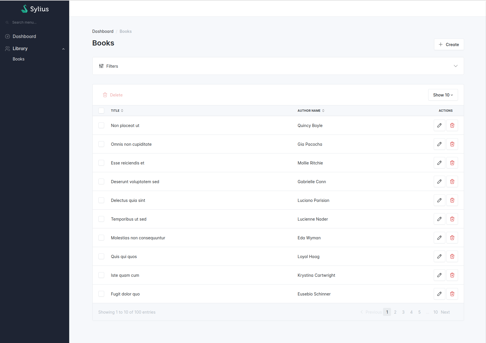
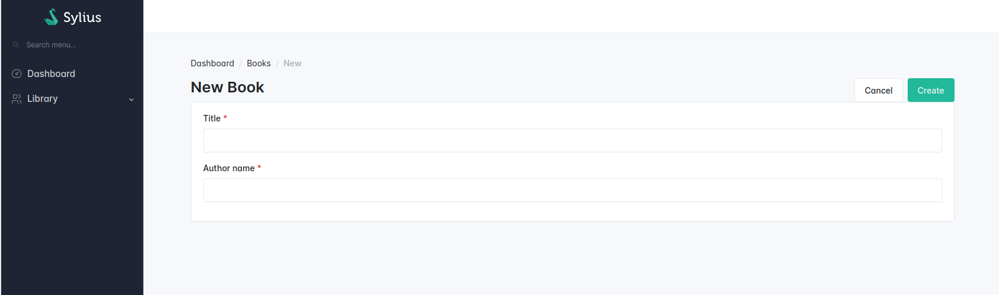

# How to customize your admin panel

## How to add a new list of resources

<div data-full-width="false">

<figure></figure>

</div>

Create a grid for your resource.

```shell
bin/console make:grid
```

Configure the `index` operation in your resource.

```php
namespace App\Entity;

use App\Grid\BookGrid;
use Sylius\Resource\Metadata\AsResource;
use Sylius\Resource\Metadata\Index;
use Sylius\Resource\Model\ResourceInterface;

#[AsResource(
    section: 'admin', // This will influence the route name
    routePrefix: '/admin',
    templatesDir: '@SyliusAdminUi/crud', // This directory contains the generic template for your list
    operations: [
        new Index( // This operation will add "index" operation for the books list
            grid: BookGrid::class, // Use the grid class you have generated in previous step
        ), 
    ],    
)]
class Book implements ResourceInterface
{
    //...
}
```

Use the Symfony `debug:router` command to check the results.

```shell
bin/console debug:router
```

Your route should look like this.

```shell
 ------------------------------ ---------------------------
  Name                           Path                                           
 ------------------------------ ---------------------------                  
  app_admin_book_index           /admin/books               
```

## How to add a resource creation page

<div data-full-width="false">

<figure></figure>

</div>

Create a form type for your resource.

```shell
bin/console make:form

Configure the `create` operation in your resource.

```php
namespace App\Entity;

use App\Form\BookType;
use Sylius\Resource\Metadata\AsResource;
use Sylius\Resource\Metadata\Create;
use Sylius\Resource\Model\ResourceInterface;

#[AsResource(
    section: 'admin', // This will influence the route name
    routePrefix: '/admin',
    templatesDir: '@SyliusAdminUi/crud', // This directory contains the generic template for your list
    formType: BookType::class, // The form type you have generated in previous step
    operations: [
        // ...
        new Create(), // This operation will add "create" operation for the book resource
    ],    
)]
class Book implements ResourceInterface
{
    //...
}
```

Use the Symfony `debug:router` command to check the results.

```shell
bin/console debug:router
```

Your route should look like this.

```shell
 ------------------------------ ---------------------------
  Name                           Path                                           
 ------------------------------ ---------------------------                  
  app_admin_book_create           /admin/books/new               

## How to customize the sidebar logo

To customize the sidebar logo, you need to set new logo template at `sylius_admin.common.component.sidebar.logo` twig hook.
Choose the YAML or the PHP version.

```yaml
# config/packages/sylius_bootstrap_admin_ui.yaml
# ...
sylius_twig_hooks:
    hooks:
        # ...
        'sylius_admin.common.component.sidebar.logo':
            image:
                # template: '@SyliusBootstrapAdminUi/shared/crud/common/sidebar/logo/image.html.twig'
                template: 'shared/crud/common/sidebar/logo/image.html.twig'

```

```php
// config/packages/sylius_bootstrap_admin_ui.php
use Symfony\Component\DependencyInjection\Loader\Configurator\ContainerConfigurator;

return static function (ContainerConfigurator $containerConfigurator): void {
    // ...

    // Add these following lines to define your own Twig template for the logo.
    $containerConfigurator->extension('sylius_twig_hooks', [
        'hooks' => [
            'sylius_admin.common.component.sidebar.logo' => [
                'image' => [
                    // 'template' => '@SyliusBootstrapAdminUi/shared/crud/common/sidebar/logo/image.html.twig',
                    'template' => 'shared/crud/common/sidebar/logo/image.html.twig',
                ],
            ],
        ],
        
    ]);
};

```

```twig

{# templates/shared/crud/common/sidebar/logo/image.html.twig #}



  
```

## How to customize the login page logo

To customize the login page logo,you need to set new logo template at `sylius_admin.security.login.logo` twig hook.
Choose the YAML or the PHP version.

```yaml
# config/packages/sylius_bootstrap_admin_ui.yaml
# ...
sylius_twig_hooks:
    hooks:
        # ...
        'sylius_admin.security.login.logo':
            image:
                # template: '@SyliusBootstrapAdminUi/security/common/logo/image.html.twig'
                template: 'security/common/logo/image.html.twig'

```

```php
// config/packages/sylius_bootstrap_admin_ui.php
use Symfony\Component\DependencyInjection\Loader\Configurator\ContainerConfigurator;

return static function (ContainerConfigurator $containerConfigurator): void {
    // ...

    // Add these following lines to define your own Twig template for the logo.
    $containerConfigurator->extension('sylius_twig_hooks', [
        'hooks' => [
            'sylius_admin.security.login.logo' => [
                'image' => [
                    // 'template' => '@SyliusBootstrapAdminUi/security/common/logo/image.html.twig'
                    'template' => 'security/common/logo/image.html.twig',
                ],
            ],
        ],
    ]);
};
```

```twig



```

## How to customize the admin menu

You should decorate the `sylius_admin_ui.knp.menu_builder` service to customize the admin menu.

```php
declare(strict_types=1);

namespace App\Menu;

use Knp\Menu\FactoryInterface;
use Knp\Menu\ItemInterface;
use Sylius\AdminUi\Knp\Menu\MenuBuilderInterface
use Symfony\Component\DependencyInjection\Attribute\AsDecorator;

#[AsDecorator(decorates: 'sylius_admin_ui.knp.menu_builder')]
final readonly class MenuBuilder implements MenuBuilderInterface
{
    public function __construct(
        private readonly FactoryInterface $factory,
    ) {
    }

    public function createMenu(array $options): ItemInterface
    {
        $menu = $this->factory->createItem('root');

        $menu
            ->addChild('dashboard', [
                'route' => 'sylius_admin_ui_dashboard',
            ])
            ->setLabel('sylius.ui.dashboard')
            ->setLabelAttribute('icon', 'dashboard')
        ;
    }
}
