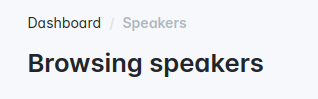
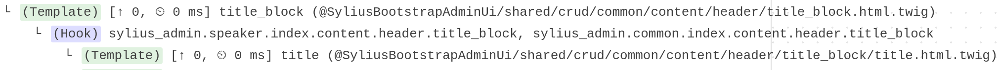
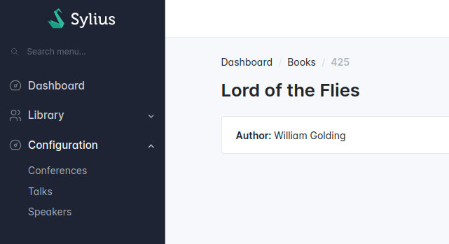
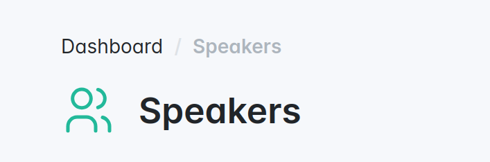
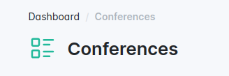
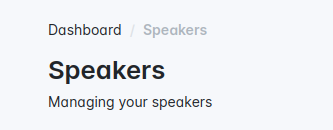

# Customizing the page titles

## Changing the default title for a specific page

<div data-full-width="false">

<figure></figure>

</div>

By default, each page has a default title based on both page location and resource name.
If you're not happy with the preset title for a specific page and would like to customize it, 
you can easily change it using Twig Hooks.

Search for "title_block" in the call graph of the Symfony debug profiler in the `Twig Hooks` section.

<div data-full-width="false">

<figure></figure>

</div>

We're going to reuse this hook and its template in our config file and add a `header` key:




```yaml
# config/packages/sylius_bootstrap_admin_ui.yaml
# ...
sylius_twig_hooks:
    hooks:
        # ...
        'sylius_admin.speaker.index.content.header.title_block': # The speaker index title block
            title:
                template: '@SyliusBootstrapAdminUi/shared/crud/common/content/header/title_block/title.html.twig'
                configuration:
                    title: app.ui.browsing_speakers # here is our title override
```





```php
// config/packages/sylius_bootstrap_admin_ui.php
use Symfony\Component\DependencyInjection\Loader\Configurator\ContainerConfigurator;

return static function (ContainerConfigurator $containerConfigurator): void {
    // ...
    $containerConfigurator->extension('sylius_twig_hooks', [
        'hooks' => [
            // The speaker index title block
            'sylius_admin.speaker.index.content.header.title_block' => [
                'title' => [
                    'template' => '@SyliusBootstrapAdminUi/shared/crud/common/content/header/title_block/title.html.twig',
                    'configuration' => [
                        'title' => 'app.ui.browsing_speakers' // here is our title override 
                    ],
                ],
            ],
        ],        
    ]);
};
```




<div data-full-width="false">

<figure></figure>

</div>

Note that you can also use [Symfony Expression Language](https://symfony.com/doc/current/components/expression_language.html) in the configuration key for dynamic titles:




```yaml
# config/packages/sylius_bootstrap_admin_ui.yaml
# ...
sylius_twig_hooks:
    hooks:
        # ...
        'sylius_admin.book.show.content.header.title_block': # The show page title block
            title:
                template: '@SyliusBootstrapAdminUi/shared/crud/common/content/header/title_block/title.html.twig'
                configuration:
                    title: '@=_context.book.getTitle()' # Use the current book title
```





```php
// config/packages/sylius_bootstrap_admin_ui.php
use Symfony\Component\DependencyInjection\Loader\Configurator\ContainerConfigurator;

return static function (ContainerConfigurator $containerConfigurator): void {
    // ...
    $containerConfigurator->extension('sylius_twig_hooks', [
        'hooks' => [
            // The show page title block
            'sylius_admin.book.show.content.header.title_block' => [
                'title' => [
                    'template' => '@SyliusBootstrapAdminUi/shared/crud/common/content/header/title_block/title.html.twig',
                    'configuration' => [
                        'title' => '@=_context.book.getTitle()' // Use the current book title
                    ],
                ],
            ],
        ],        
    ]);
};
```




`@=_context` contains all the current Twig vars.

## Adding an icon

<div data-full-width="false">

<figure></figure>

</div>

To add an icon to the page title, you need to use Twig hooks configuration.

Search for "title_block" in the call graph of the Symfony debug profiler in the `Twig Hooks` section. 
We're going to reuse this hook and its template in our config file.

<div data-full-width="false">

<figure></figure>

</div>

Here's an example to define a "users" icon on a speaker list.




```yaml
# config/packages/sylius_bootstrap_admin_ui.yaml
# ...
sylius_twig_hooks:
    hooks:
        # ...
        'sylius_admin.speaker.index.content.header.title_block':
            title:
                # We need to reuse the same template as 'sylius_admin.common.index.content.header.title_block'
                template: '@SyliusBootstrapAdminUi/shared/crud/common/content/header/title_block/title.html.twig'
                configuration:
                    icon: tabler:users # You can use any icon from Symfony UX icons.
```





```php
// config/packages/sylius_bootstrap_admin_ui.php
use Symfony\Component\DependencyInjection\Loader\Configurator\ContainerConfigurator;

return static function (ContainerConfigurator $containerConfigurator): void {
    // ...
    $containerConfigurator->extension('sylius_twig_hooks', [
        'hooks' => [
            'sylius_admin.speaker.index.content.header.title_block' => [
                'title' => [
                    // # We need to reuse the same template as 'sylius_admin.common.index.content.header.title_block'
                    'template' => '@SyliusBootstrapAdminUi/shared/crud/common/content/header/title_block/title.html.twig',
                    'configuration' => [
                        'icon' => 'tabler:users' // You can use any icon from Symfony UX icons.
                    ],
                ],
            ],
        ],        
    ]);
};
```




You can also define a default icon for every "index" pages.

<div data-full-width="false">

<figure></figure>

</div>




```yaml
# config/packages/sylius_bootstrap_admin_ui.yaml
# ...
sylius_twig_hooks:
    hooks:
        # ...
        'sylius_admin.common.index.content.header.title_block':
            title:
                configuration:
                    icon: tabler:list-details
```





```php
// config/packages/sylius_bootstrap_admin_ui.php
use Symfony\Component\DependencyInjection\Loader\Configurator\ContainerConfigurator;

return static function (ContainerConfigurator $containerConfigurator): void {
    // ...
    $containerConfigurator->extension('sylius_twig_hooks', [
        'hooks' => [
            'sylius_admin.common.index.content.header.title_block' => [
                'title' => [
                    'configuration' => [
                        'icon' => 'list-details'
                    ],
                ],
            ],
        ],        
    ]);
};
```




## Adding a subheader

<div data-full-width="false">

<figure></figure>

</div>

To add a subheader to the page title, you need to use Twig hooks configuration.

See the [previous section](#adding-an-icon) to see how to search for the title block.

Here's an example to define a subheader on a speaker list.




```yaml
# config/packages/sylius_bootstrap_admin_ui.yaml
# ...
sylius_twig_hooks:
    hooks:
        # ...
        'sylius_admin.speaker.index.content.header.title_block':
            title:
                # We need to reuse the same template as 'sylius_admin.common.index.content.header.title_block'
                template: '@SyliusBootstrapAdminUi/shared/crud/common/content/header/title_block/title.html.twig'
                configuration:
                    subheader: app.ui.managing_your_speakers # You also need to add this key to your translations.
```





```php
// config/packages/sylius_bootstrap_admin_ui.php
use Symfony\Component\DependencyInjection\Loader\Configurator\ContainerConfigurator;

return static function (ContainerConfigurator $containerConfigurator): void {
    // ...
    $containerConfigurator->extension('sylius_twig_hooks', [
        'hooks' => [
            'sylius_admin.speaker.index.content.header.title_block' => [
                'title' => [
                    // We need to reuse the same template as 'sylius_admin.common.index.content.header.title_block'
                    'template' => '@SyliusBootstrapAdminUi/shared/crud/common/content/header/title_block/title.html.twig',
                    'configuration' => [
                        'subheader' => 'app.ui.managing_your_speakers' // You also need to add this key to your translations.
                    ],
                ],
            ],
        ],        
    ]);
};
```



