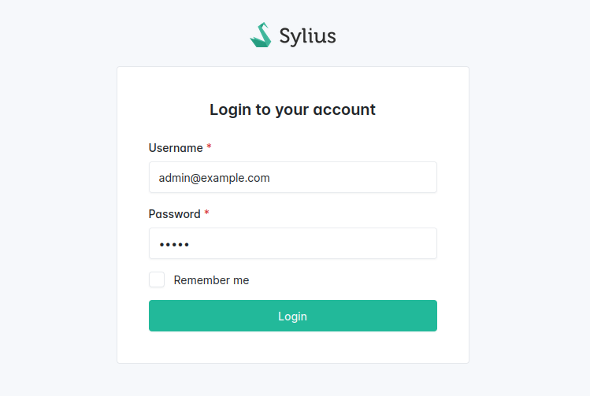

# Configuring the Security access

<div data-full-width="false">

<figure></figure>

</div>

Now that you have an admin panel, you want to make sure admin users are the only ones allowed to access its URL.
To secure your back-office interface, you can simply resort to Symfony's Security configuration with 4 basic steps : 
* [Create a User](#create-a-user-entity)
* [Create the user provider](#configure-the-user-provider)
* [Configure firewalls](#configure-the-firewall) 
* [Configure the access control authorization](#configure-access-control-authorization)

## Create a user entity

You can use the Symfony maker to create a new user.

```shell
bin/console make:user
```


Learn more on how to [create a User](https://symfony.com/doc/current/security.html#the-user)


## Configure the user provider

Here is an example of a user provider configuration:


```yaml
security:
    # https://symfony.com/doc/current/security.html#registering-the-user-hashing-passwords
    password_hashers:
        Symfony\Component\Security\Core\User\PasswordAuthenticatedUserInterface: 'auto'
    # https://symfony.com/doc/current/security.html#loading-the-user-the-user-provider
    providers:
        # used to reload user from session & other features (e.g. switch_user)
        app_admin_user_provider:
            entity:
                class: App\Entity\User
                property: email
```



Learn more on how to [create a user provider on the Symfony documentation](https://symfony.com/doc/current/security.html#the-user)


## Configure the firewall

Here is an example of how to configure a firewall for your admin routes:


```yaml
security:
    firewalls:
        # ...
        admin:
            context: admin
            pattern: '/admin(?:/.*)?$'
            provider: app_admin_user_provider # Reuse the provider key you configured on providers section
            form_login:
                # These routes are provided by Sylius Admin Ui package
                login_path: sylius_admin_ui_login 
                check_path: sylius_admin_ui_login_check
                default_target_path: sylius_admin_ui_dashboard
            logout:
                # These routes are provided by Sylius Admin Ui package
                path: sylius_admin_ui_logout
                target: sylius_admin_ui_login
```



Learn more on how to [configure the firewall on the Symfony documentation](https://symfony.com/doc/current/security.html#the-firewall)


## Configure Access Control Authorization

Only admin users will have access to "/admin" routes.


```yaml
security:
    access_control:
        - { path: ^/admin/login, roles: PUBLIC_ACCESS }
        - { path: ^/admin/logout, roles: PUBLIC_ACCESS }
        - { path: ^/admin, roles: ROLE_ADMIN }
        - { path: ^/, roles: PUBLIC_ACCESS }
```



Learn more on how to [configure Access Control Authorization on the Symfony documentation](https://symfony.com/doc/current/security.html#access-control-authorization)

