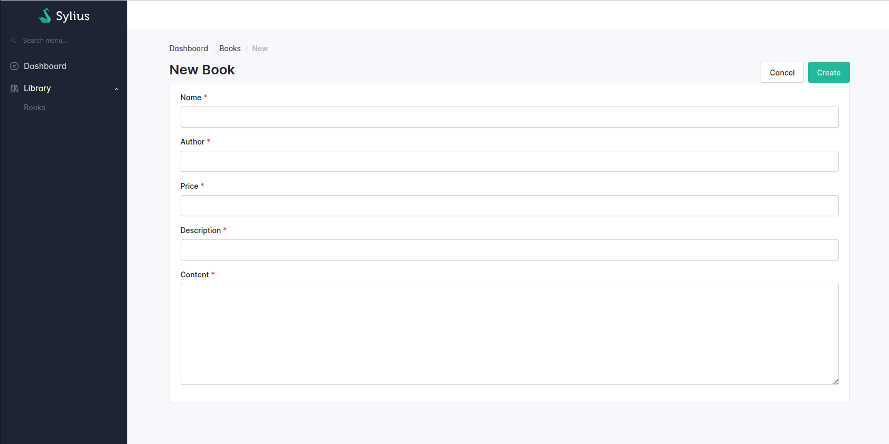
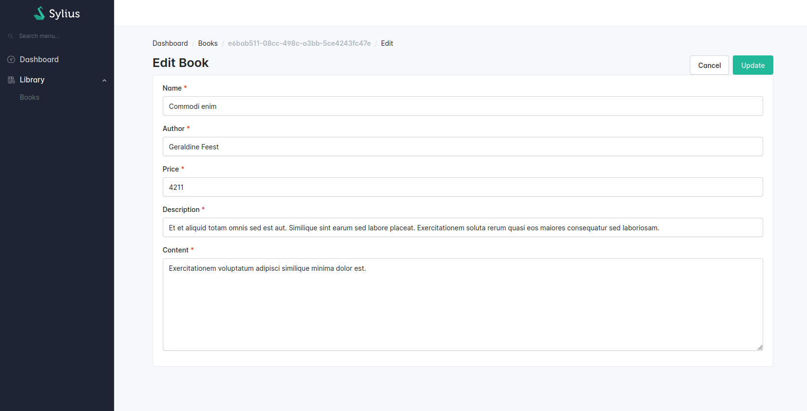
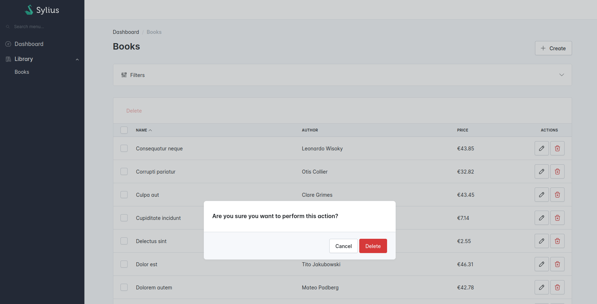

# Basic operations

In the previous chapter, we have created the Sylius resource. Now, we need to create the basic operations.
To achieve that, we reuse commands & queries we already have in the Application folder to create providers & processors.

```txt
src
└── BookStore
    ├── Application
    │   ├── Command
    │   │   ├── CreateBookCommand.php
    │   │   ├── UpdateBookCommand.php
    │   │   └── DeleteBookCommand.php
    │   └── Query
    │       └── FindBookQuery.php
    ├── Domain
    └── Infrastructure
        └── Sylius
            └── State
                ├── Provider
                │   └── BookItemProvider.php
                └── Processor 
                    ├── CreateBookProcessor.php   
                    ├── UpdateBookProcessor.php
                    └── DeleteBookProcessor.php
```

## Book creation

<div data-full-width="false">

<figure></figure>

</div>

In the Application folder, we already have this `CreateBookCommand`:

```php
// src/Bookstore/Application/Command/CreateBookCommand.php

declare(strict_types=1);

namespace App\BookStore\Application\Command;

use App\BookStore\Domain\Model\Book;
use App\BookStore\Domain\ValueObject\Author;
use App\BookStore\Domain\ValueObject\BookContent;
use App\BookStore\Domain\ValueObject\BookDescription;
use App\BookStore\Domain\ValueObject\BookName;
use App\BookStore\Domain\ValueObject\Price;
use App\Shared\Application\Command\CommandInterface;

/**
 * @implements CommandInterface<Book>
 */
final readonly class CreateBookCommand implements CommandInterface
{
    public function __construct(
        public BookName $name,
        public BookDescription $description,
        public Author $author,
        public BookContent $content,
        public Price $price,
    ) {
    }
}
```

The idea is to reuse this command to create the book in the storage for your "create" operation.

### Create the CreateBookProcessor

First, we need to add the `CreateBookProcessor` in which we're going to call our `CreateBookCommand`.

```php
// src/BookStore/Infrastructure/Sylius/State/Processor/CreateBookProcessor.php

declare(strict_types=1);

namespace App\BookStore\Infrastructure\Sylius\State\Processor;

use App\BookStore\Application\Command\CreateBookCommand;
use App\BookStore\Domain\ValueObject\Author;
use App\BookStore\Domain\ValueObject\BookContent;
use App\BookStore\Domain\ValueObject\BookDescription;
use App\BookStore\Domain\ValueObject\BookName;
use App\BookStore\Domain\ValueObject\Price;
use App\BookStore\Infrastructure\Sylius\Resource\BookResource;
use App\Shared\Application\Command\CommandBusInterface;
use Sylius\Resource\Context\Context;
use Sylius\Resource\Metadata\Operation;
use Sylius\Resource\State\ProcessorInterface;
use Webmozart\Assert\Assert;

/**
 * @implements ProcessorInterface<BookResource>
 */
final readonly class CreateBookProcessor implements ProcessorInterface
{
    public function __construct(
        private CommandBusInterface $commandBus,
    ) {
    }

    public function process(mixed $data, Operation $operation, Context $context): BookResource
    {
        Assert::isInstanceOf($data, BookResource::class);

        Assert::notNull($data->name);
        Assert::notNull($data->description);
        Assert::notNull($data->author);
        Assert::notNull($data->content);
        Assert::notNull($data->price);

        $command = new CreateBookCommand(
            new BookName($data->name),
            new BookDescription($data->description),
            new Author($data->author),
            new BookContent($data->content),
            new Price($data->price),
        );

        $model = $this->commandBus->dispatch($command);

        return BookResource::fromModel($model);
    }
}
```

### Adding the processor on the Book Resource

Then, we add the `Create` operation on our `BookResource`.

```php
// src/BookStore/Infrastructure/Sylius/Resource/BookResource.php

// ...
use App\BookStore\Infrastructure\Sylius\State\Processor\CreateBookProcessor;
use App\BookStore\Infrastructure\Symfony\Form\BookResourceType;
use Sylius\Resource\Metadata\Create;
use Sylius\Resource\Model\ResourceInterface;
// ...

#[AsResource(
    // ...
    formType: BookResourceType::class, // Define the form type for all your operations
    operations: [
        new Create(
            processor: CreateBookProcessor::class, // the processor we have just created
            // formType: CreateBookResourceType::class, // Optional: define a specific form type only for the "create" operation
        ),
    ],
)]
final class BookResource implements ResourceInterface
{
    // ...
}
```

## Book edition

<div data-full-width="false">

<figure></figure>

</div>

Now, we want to be able to edit an existing book. In the Application folder, we already have this `UpdateBookCommand`:

```php
// src/Bookstore/Application/Command/UpdateBookCommand.php

declare(strict_types=1);

namespace App\BookStore\Application\Command;

use App\BookStore\Domain\Model\Book;
use App\BookStore\Domain\ValueObject\Author;
use App\BookStore\Domain\ValueObject\BookContent;
use App\BookStore\Domain\ValueObject\BookDescription;
use App\BookStore\Domain\ValueObject\BookId;
use App\BookStore\Domain\ValueObject\BookName;
use App\BookStore\Domain\ValueObject\Price;
use App\Shared\Application\Command\CommandInterface;

/**
 * @implements CommandInterface<Book>
 */
final readonly class UpdateBookCommand implements CommandInterface
{
    public function __construct(
        public BookId $id,
        public ?BookName $name = null,
        public ?BookDescription $description = null,
        public ?Author $author = null,
        public ?BookContent $content = null,
        public ?Price $price = null,
    ) {
    }
}
```

In the same folder, we also have this existing `FindBookQuery`:

```php
// src/BookStore/Application/Query/FindBookQuery.php

declare(strict_types=1);

namespace App\BookStore\Application\Query;

use App\BookStore\Domain\Model\Book;
use App\BookStore\Domain\ValueObject\BookId;
use App\Shared\Application\Query\QueryInterface;

/**
 * @implements QueryInterface<Book>
 */
final readonly class FindBookQuery implements QueryInterface
{
    public function __construct(
        public BookId $id,
    ) {
    }
}
```

The idea is to reuse these query and command to update the book in the storage for your "update" operation.

### Create the BookItemProvider

First, we need to create the `BookItemProvider` in order to fetch the right book.

```php
// src/BookStore/Infrastructure/Sylius/State/Provider/BookItemProvider.php

declare(strict_types=1);

namespace App\BookStore\Infrastructure\Sylius\State\Provider;

use App\BookStore\Application\Query\FindBookQuery;
use App\BookStore\Domain\ValueObject\BookId;
use App\BookStore\Infrastructure\Sylius\Resource\BookResource;
use App\Shared\Application\Query\QueryBusInterface;
use Sylius\Resource\Context\Context;
use Sylius\Resource\Context\Option\RequestOption;
use Sylius\Resource\Metadata\Operation;
use Sylius\Resource\State\ProviderInterface;
use Symfony\Component\Uid\Uuid;

/**
 * @implements ProviderInterface<BookResource>
 */
final readonly class BookItemProvider implements ProviderInterface
{
    public function __construct(
        private QueryBusInterface $queryBus,
    ) {
    }

    public function provide(Operation $operation, Context $context): object|array|null
    {
        $id = $context->get(RequestOption::class)
            ?->request()
            ->attributes
            ->getString('id')
        ;

        $model = $this->queryBus->ask(new FindBookQuery(new BookId(Uuid::fromString($id))));

        return BookResource::fromModel($model);
    }
}
```

### Create the UpdateBookProcessor

We also need to create the `UpdateBookProcessor` where we're going to call our `UpdateBookCommand`.

```php
// src/BookStore/Infrastructure/Sylius/State/Processor/UpdateBookProcessor.php

declare(strict_types=1);

namespace App\BookStore\Infrastructure\Sylius\State\Processor;

use App\BookStore\Application\Command\UpdateBookCommand;
use App\BookStore\Domain\ValueObject\Author;
use App\BookStore\Domain\ValueObject\BookContent;
use App\BookStore\Domain\ValueObject\BookDescription;
use App\BookStore\Domain\ValueObject\BookId;
use App\BookStore\Domain\ValueObject\BookName;
use App\BookStore\Domain\ValueObject\Price;
use App\BookStore\Infrastructure\Sylius\Resource\BookResource;
use App\Shared\Application\Command\CommandBusInterface;
use Sylius\Resource\Context\Context;
use Sylius\Resource\Metadata\Operation;
use Sylius\Resource\State\ProcessorInterface;
use Webmozart\Assert\Assert;

/**
 * @implements ProcessorInterface<BookResource>
 */
final readonly class UpdateBookProcessor implements ProcessorInterface
{
    public function __construct(
        private CommandBusInterface $commandBus,
    ) {
    }

    public function process(mixed $data, Operation $operation, Context $context): mixed
    {
        Assert::isInstanceOf($data, BookResource::class);

        $command = new UpdateBookCommand(
            new BookId($data->id),
            null !== $data->name ? new BookName($data->name) : null,
            null !== $data->description ? new BookDescription($data->description) : null,
            null !== $data->author ? new Author($data->author) : null,
            null !== $data->content ? new BookContent($data->content) : null,
            null !== $data->price ? new Price($data->price) : null,
        );

        $model = $this->commandBus->dispatch($command);

        return BookResource::fromModel($model);
    }
}
```

### Adding the provider & processor on the Book Resource

Now, we add the "update" operation on the `BookResource`.

```php
// src/BookStore/Infrastructure/Sylius/Resource/BookResource.php

// ...
use App\BookStore\Infrastructure\Sylius\State\Processor\UpdateBookProcessor;
use App\BookStore\Infrastructure\Sylius\State\Provider\BookItemProvider;
use App\BookStore\Infrastructure\Symfony\Form\BookResourceType;
use Sylius\Resource\Metadata\Update;
// ...

#[AsResource(
    // ...
    formType: BookResourceType::class, // Define the form type for all your operations
    operations: [
        // ...
        new Update(
            provider: BookItemProvider::class, // the provider we have just created
            processor: UpdateBookProcessor::class, // the processor we have just created
            // formType: UpdateBookResourceType::class, // Optional: define a specific form type only for the "update" operation
        ),
    ],
)]
final class BookResource implements ResourceInterface
{
    // ...
}
```

## Book removal

<div data-full-width="false">

<figure></figure>

</div>

Now that we can update an existing book, we also want to be able to delete it. In the Application folder, we already have this `DeleteBookCommand`:

```php
// src/BookStore/Application/Command/DeleteBookCommand.php

declare(strict_types=1);

namespace App\BookStore\Application\Command;

use App\BookStore\Domain\ValueObject\BookId;
use App\Shared\Application\Command\CommandInterface;

/**
 * @implements CommandInterface<void>
 */
final readonly class DeleteBookCommand implements CommandInterface
{
    public function __construct(
        public BookId $id,
    ) {
    }
}
```

### Create the DeleteBookProcessor

We need to create the `DeleteBookProcessor`.

```php
// src/BookStore/Infrastructure/Sylius/State/Processor/DeleteBookProcessor.php

declare(strict_types=1);

namespace App\BookStore\Infrastructure\Sylius\State\Processor;

use App\BookStore\Application\Command\DeleteBookCommand;
use App\BookStore\Domain\ValueObject\BookId;
use App\BookStore\Infrastructure\Sylius\Resource\BookResource;
use App\Shared\Application\Command\CommandBusInterface;
use Sylius\Resource\Context\Context;
use Sylius\Resource\Metadata\Operation;
use Sylius\Resource\State\ProcessorInterface;
use Webmozart\Assert\Assert;

/**
 * @implements ProcessorInterface<null>
 */
final readonly class DeleteBookProcessor implements ProcessorInterface
{
    public function __construct(
        private CommandBusInterface $commandBus,
    ) {
    }

    public function process(mixed $data, Operation $operation, Context $context): mixed
    {
        Assert::isInstanceOf($data, BookResource::class);
        $this->commandBus->dispatch(new DeleteBookCommand(new BookId($data->id)));

        return null;
    }
}
```

### Adding the processor on the Book Resource

And then we create the "delete" operation on the BookResource.

```php
// src/BookStore/Infrastructure/Sylius/Resource/BookResource.php

// ...
use App\BookStore\Infrastructure\Sylius\State\Processor\DeleteBookProcessor;
use App\BookStore\Infrastructure\Sylius\State\Provider\BookItemProvider;
use Sylius\Resource\Metadata\Delete;
// ...

#[AsResource(
    // ...
    operations: [
        // ...
        new Delete(
            provider: BookItemProvider::class, // the provider we have already created in book creation
            processor: DeleteBookProcessor::class, // the processor we have just created
        ),
    ],
)]
final class BookResource implements ResourceInterface
{
    // ...
}
```
