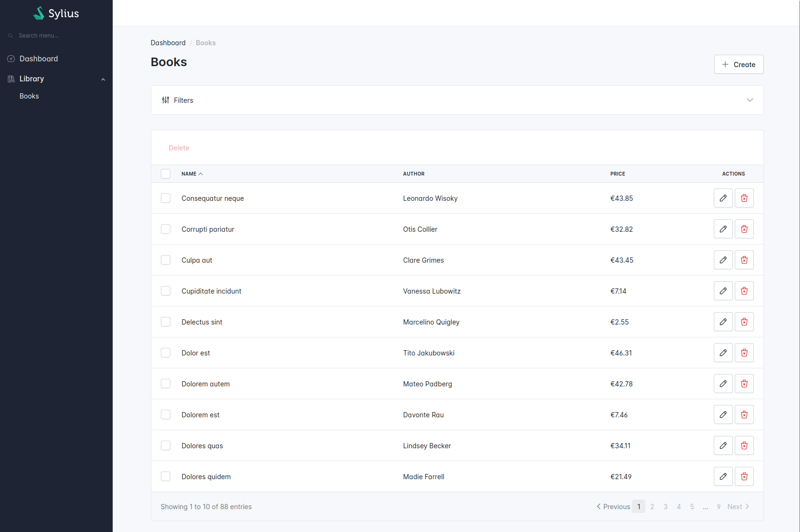

# Operation using a Grid

In previous chapters, we have created the Sylius resource and basic operations. Now we need to create the index operation using a Grid.
To achieve that, we reuse the query we already have in the Application folder to create a grid provider.

```txt
src
├── BookStore
│   ├── Application
│   │   └── Query
│   │       ├── FindBooksQuery.php
│   │       └── FindBooksQueryHandler.php
│   ├── Domain
│   └── Infrastructure
│       └── Sylius
│           └── Grid
│               ├── Filter
│               │   ├── AuthorFilter.php
│               │   └── AuthorFilterType.php
│               ├── BookGrid.php
│               └── BookGridProvider.php
└── Shared
    └── Infrastructure
        └── Sylius
            └── Grid
                └── GridPageResolver.php
```

## Book list

<div data-full-width="false">

<figure></figure>

</div>

In the Application folder, we already have this `FindBooksQuery`:


```php

declare(strict_types=1);

namespace App\BookStore\Application\Query;

use App\BookStore\Domain\Repository\BookRepositoryInterface;
use App\BookStore\Domain\ValueObject\Author;
use App\Shared\Application\Query\QueryInterface;

/**
 * @implements QueryInterface<BookRepositoryInterface>
 */
final readonly class FindBooksQuery implements QueryInterface
{
    public function __construct(
        public ?Author $author = null,
        public ?int $page = null,
        public ?int $itemsPerPage = null,
        public ?bool $alphabeticalSortingAsc = null,
        public ?bool $alphabeticalSortingDesc = null,
    ) {
    }
}
```


And its query handler:


```php

namespace App\BookStore\Application\Query;

use App\BookStore\Domain\Repository\BookRepositoryInterface;
use App\Shared\Application\Query\AsQueryHandler;

#[AsQueryHandler]
final readonly class FindBooksQueryHandler
{
    public function __construct(private BookRepositoryInterface $bookRepository)
    {
    }

    public function __invoke(FindBooksQuery $query): BookRepositoryInterface
    {
        $bookRepository = $this->bookRepository;

        if (null !== $query->author) {
            $bookRepository = $bookRepository->withAuthor($query->author);
        }

        if (null !== $query->page && null !== $query->itemsPerPage) {
            $bookRepository = $bookRepository->withPagination($query->page, $query->itemsPerPage);
        }

        if ($query->alphabeticalSortingAsc) {
            $bookRepository = $bookRepository->withAscendingAlphabeticalSorting();
        }

        if ($query->alphabeticalSortingDesc) {
            $bookRepository = $bookRepository->withDescendingAlphabeticalSorting();
        }

        return $bookRepository;
    }
}
```


The idea is to reuse this query to list book from your storage for your "index" operation.

### Create a page helper

To resolve current page and items per page in the grid provider, we can use this helper:


```php

declare(strict_types=1);

namespace App\Shared\Infrastructure\Sylius\Grid;

use Sylius\Component\Grid\Definition\Grid;
use Sylius\Component\Grid\Parameters;

class GridPageResolver
{
    public static function getCurrentPage(Grid $grid, Parameters $parameters): int
    {
        return $parameters->has('page') ? (int) $parameters->get('page') : 1;
    }

    public static function getItemsPerPage(Grid $grid, Parameters $parameters): int
    {
        return $parameters->has('limit') ? (int) $parameters->get('limit') : $grid->getLimits()[0] ?? 10;
    }
}
```


### Create the BookGridProvider

First, we need to create the `BookGridProvider`.


```php

declare(strict_types=1);

namespace App\BookStore\Infrastructure\Sylius\Grid;

use App\BookStore\Application\Query\FindBooksQuery;
use App\BookStore\Domain\ValueObject\Author;
use App\BookStore\Infrastructure\Sylius\Resource\BookResource;
use App\Shared\Application\Query\QueryBusInterface;
use App\Shared\Infrastructure\Sylius\Grid\GridPageResolver;
use Pagerfanta\Adapter\FixedAdapter;
use Pagerfanta\Pagerfanta;
use Pagerfanta\PagerfantaInterface;
use Sylius\Component\Grid\Data\DataProviderInterface;
use Sylius\Component\Grid\Definition\Grid;
use Sylius\Component\Grid\Parameters;
use Webmozart\Assert\Assert;

final readonly class BookGridProvider implements DataProviderInterface
{
    public function __construct(
        private QueryBusInterface $queryBus,
    ) {
    }

    public function getData(Grid $grid, Parameters $parameters): PagerfantaInterface
    {
        $models = $this->queryBus->ask(new FindBooksQuery(
            page: GridPageResolver::getCurrentPage($grid, $parameters),
            itemsPerPage: GridPageResolver::getItemsPerPage($grid, $parameters),
        ));

        $data = [];
        foreach ($models as $model) {
            $data[] = BookResource::fromModel($model);
        }
        
        $paginator = $models->paginator();
        Assert::notNull($paginator);

        return new Pagerfanta(new FixedAdapter($paginator->getTotalItems(), $data));
    }
}
```


### Create the BookGrid

Now, we need to create the `BookGrid`.


```php

declare(strict_types=1);

namespace App\BookStore\Infrastructure\Sylius\Grid;

use App\BookStore\Infrastructure\Sylius\Resource\BookResource;
use Sylius\Bundle\GridBundle\Builder\Action\CreateAction;
use Sylius\Bundle\GridBundle\Builder\Action\DeleteAction;
use Sylius\Bundle\GridBundle\Builder\Action\UpdateAction;
use Sylius\Bundle\GridBundle\Builder\ActionGroup\BulkActionGroup;
use Sylius\Bundle\GridBundle\Builder\ActionGroup\ItemActionGroup;
use Sylius\Bundle\GridBundle\Builder\ActionGroup\MainActionGroup;
use Sylius\Bundle\GridBundle\Builder\Field\StringField;
use Sylius\Bundle\GridBundle\Builder\Field\TwigField;
use Sylius\Bundle\GridBundle\Builder\GridBuilderInterface;
use Sylius\Bundle\GridBundle\Grid\AbstractGrid;
use Sylius\Bundle\GridBundle\Grid\ResourceAwareGridInterface;

final class BookGrid extends AbstractGrid implements ResourceAwareGridInterface
{
    public static function getName(): string
    {
        return self::class;
    }

    public function buildGrid(GridBuilderInterface $gridBuilder): void
    {
        $gridBuilder
            ->setProvider(BookGridProvider::class) // The Grid provider we have just created
            ->addField(
                StringField::create('name')
            )
            ->addField(
                StringField::create('author'),
            )
            ->addActionGroup(
                MainActionGroup::create(
                    CreateAction::create(),
                ),
            )
            ->addActionGroup(
                ItemActionGroup::create(
                    UpdateAction::create(),
                    DeleteAction::create(),
                ),
            )
            ->addActionGroup(
                BulkActionGroup::create(
                    DeleteAction::create(),
                ),
            )
        ;
    }

    public function getResourceClass(): string
    {
        return BookResource::class;
    }
}
```


### Add the grid on the Book Resource

Now that we have a grid, let's add it to the "index" operation on our `BookResource`.


```php
// ...
use App\BookStore\Infrastructure\Sylius\Grid\BookGrid;
use App\BookStore\Infrastructure\Symfony\Form\BookResourceType;
use Sylius\Resource\Metadata\AsResource;
use Sylius\Resource\Metadata\Index;
use Sylius\Resource\Model\ResourceInterface;
// ...

#[AsResource(
    // ...
    formType: BookResourceType::class, // Define the form type for all your operations
    operations: [
        // ...
        new Index(
            grid: BookGrid::class, // the grid we have just created
        ),
    ],
)]
final class BookResource implements ResourceInterface
{
    // ...
}
```


### Create the Author filter type

Let's imagine we want to be able to filter books by their author within our grid. First, we need to create a Symfony form type for our custom author filter.


```php

declare(strict_types=1);

namespace App\BookStore\Infrastructure\Sylius\Grid\Filter;

use App\BookStore\Application\Query\FindBooksQuery;
use App\BookStore\Domain\Model\Book;
use App\Shared\Application\Query\QueryBusInterface;
use Symfony\Component\Form\AbstractType;
use Symfony\Component\Form\Extension\Core\Type\ChoiceType;
use Symfony\Component\OptionsResolver\OptionsResolver;

final class AuthorFilterType extends AbstractType
{
    public function __construct(
        private readonly QueryBusInterface $queryBus,
    ) {
    }

    public function configureOptions(OptionsResolver $resolver): void
    {
        $resolver->setDefaults([
            'placeholder' => 'sylius.ui.all',
            'choices' => $this->getChoices(),
        ]);
    }

    public function getParent(): string
    {
        return ChoiceType::class;
    }

    private function getChoices(): array
    {
        // We do not have any findAuthorsQuery
        // Authors are stored in the Book resource
        $models = $this->queryBus->ask(new FindBooksQuery());

        $choices = [];

        /** @var Book $model */
        foreach ($models as $model) {
            $choices[$model->author()->value] = $model->author()->value;
        }

        ksort($choices);

        return $choices;
    }
}
```


### Create the Author filter


```php

declare(strict_types=1);

namespace App\BookStore\Infrastructure\Sylius\Grid\Filter;

use Sylius\Component\Grid\Data\DataSourceInterface;
use Sylius\Component\Grid\Filtering\ConfigurableFilterInterface;

final readonly class AuthorFilter implements ConfigurableFilterInterface
{
    public function apply(DataSourceInterface $dataSource, string $name, $data, array $options): void
    {
        throw new \RuntimeException('Not implemented'); // We cannot use the DataSource generic abstraction
    }

    public static function getFormType(): string
    {
        return AuthorFilterType::class; // The Symfony form type we have just created
    }

    public static function getType(): string
    {
        return self::class;
    }
} 
```


### Use the Author Filter on the Grid provider


```php
final readonly class BookGridProvider implements DataProviderInterface
{
    // ...

    public function getData(Grid $grid, Parameters $parameters): PagerfantaInterface
    {
        /** @var array<string, string> $criteria */
        $criteria = $parameters->get('criteria', []); // Getting the criteria from query params

        $models = $this->queryBus->ask(new FindBooksQuery(
            author: !empty($criteria['author'] ?? null) ? new Author($criteria['author']) : null,
            page: GridPageResolver::getCurrentPage($grid, $parameters),
            itemsPerPage: GridPageResolver::getItemsPerPage($grid, $parameters),
        ));

        // ...
    }
}
```

