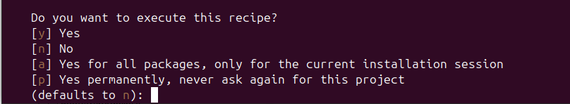
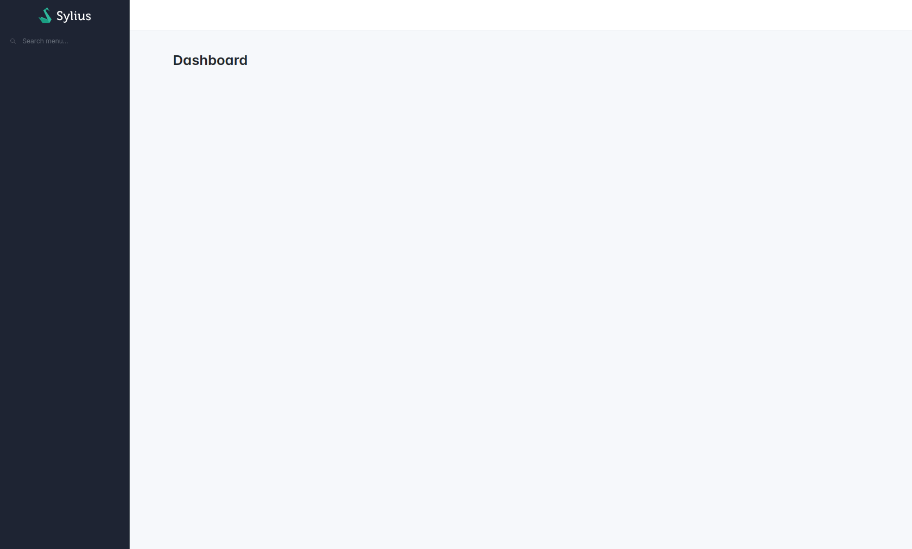

# Getting started

## Setup an admin panel

The Sylius Stack comes with a bunch of components that work great independently, but when they come together, that's when the stack's magic truly operates! 
Indeed, the highlight of this project is the ability to configure an admin panel UI within minutes.

### Install the package using Composer and Symfony Flex

```bash
composer require -W \
  doctrine/orm "^2.16" \
  sylius/bootstrap-admin-ui \
  sylius/ui-translations
```

<div data-full-width="false">

<figure></figure>

</div>

Type "a" or "p" to configure the packages via Symfony Flex.

### Install missing tom-select assets

```bash
symfony console importmap:require tom-select/dist/css/tom-select.default.cs
```

### Run your web server

```bash
docker compose up -d
symfony serve -d
```

The admin panel is ready to use.
Now, it's your turn!

<div data-full-width="false">

<figure></figure>

</div>
