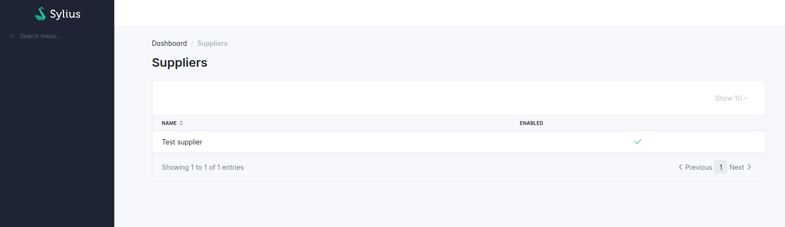
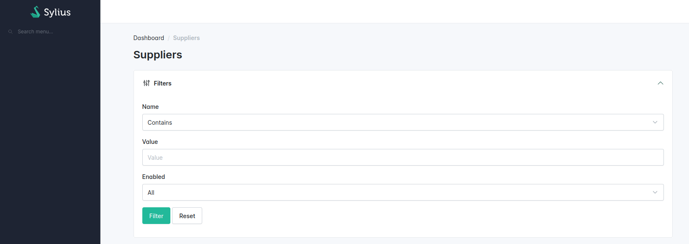
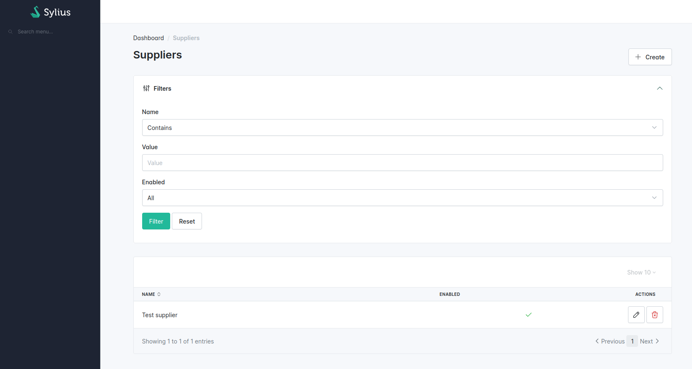

Creating Your First Grid
========================

In order to use grids, you need to register your entity as a Sylius
resource. Let us assume you have a Supplier model in your application,
which represents a supplier of goods in your shop and has several
fields, including _name_, _description_ and _enabled_.

In order to make it a Sylius resource, you need to add the `AsResource` attribute and implement `ResourceInterface`.


```php
namespace App\Entity;

use Sylius\Resource\Metadata\AsResource;
use Sylius\Resource\Model\ResourceInterface;

#[AsResource]
class Supplier implements ResourceInterface
{
    // ...
}
```


That's it! Your class is now a resource. In order to learn what it
means, please refer to the
[SyliusResourceBundle](../resource/index.md)
documentation.

## Grid Maker

You can create your grid using the [Symfony Maker bundle](https://symfony.com/bundles/SymfonyMakerBundle/current/index.html).

```shell
$ bin/console make:grid
```

## Grid Definition

Now we can configure our first grid:




```yaml
sylius_grid:
    grids:
        app_admin_supplier:
            driver:
                name: doctrine/orm
                options:
                    class: App\Entity\Supplier
            fields:
                name:
                    type: string
                    label: app.ui.name
                enabled:
                    type: twig
                    label: app.ui.enabled
                    options:
                        template: '@SyliusBootstrapAdminUi/shared/grid/field/boolean.html.twig' # This will be a checkbox field
```






```php
use App\Entity\Supplier;
use Sylius\Bundle\GridBundle\Builder\GridBuilder;
use Sylius\Bundle\GridBundle\Builder\Field\StringField;
use Sylius\Bundle\GridBundle\Builder\Field\TwigField;
use Sylius\Bundle\GridBundle\Config\GridConfig;

return static function (GridConfig $grid) {
    $grid->addGrid(GridBuilder::create('app_admin_supplier', Supplier::class)
        ->addField(
            StringField::create('name')
                ->setLabel('app.ui.name')
        )
        ->addField(
            TwigField::create('enabled', '@SyliusBootstrapAdminUi/shared/grid/field/boolean.html.twig')
                ->setLabel('app.ui.enabled')
        )
    )
};
```


OR


```php
<?php

declare(strict_types=1);

namespace App\Grid;

use App\Entity\Supplier;
use Sylius\Bundle\GridBundle\Builder\Field\StringField;
use Sylius\Bundle\GridBundle\Builder\Field\TwigField;
use Sylius\Bundle\GridBundle\Builder\GridBuilderInterface;
use Sylius\Bundle\GridBundle\Grid\AbstractGrid;
use Sylius\Bundle\GridBundle\Grid\ResourceAwareGridInterface;

final class AdminSupplierGrid extends AbstractGrid implements ResourceAwareGridInterface
{
    public static function getName(): string
    {
           return 'app_admin_supplier';
    }

    public function buildGrid(GridBuilderInterface $gridBuilder): void
    {
        $gridBuilder
            ->addField(
                StringField::create('name')
                    ->setLabel('app.ui.name')
            )
            ->addField(
                TwigField::create('enabled', '@SyliusBootstrapAdminUi/shared/grid/field/boolean.html.twig')
                    ->setLabel('app.ui.enabled')
            )
        ;
    }

    public function getResourceClass(): string
    {
        return Supplier::class;
    }
}
```





Remember that a grid is *the way objects of a desired entity are
displayed on its index view*. Therefore, only fields that are useful
for identification of objects are available - only `string` and `twig`
types. Although a Supplier also has a _description_ field, it is not needed on the index and won't be displayed here.


## Using your grid on an index operation

The `SyliusResourceBundle` allows you to use a grid into an index operation:


```php
namespace App\Entity;

use App\Grid\AdminSupplierGrid;
use Sylius\Resource\Metadata\AsResource;
use Sylius\Resource\Metadata\Index;
use Sylius\Resource\Model\ResourceInterface;

#[AsResource(
    section: 'admin', // This will influence the route name
    routePrefix: '/admin',
    templatesDir: '@SyliusAdminUi/crud', // This directory contains the generic template for your list
    operations: [
        // You can use either the FQCN of your grid
        new Index(grid: AdminSupplierGrid::class)
        // Or you can use the grid name
        new Index(grid: 'app_admin_supplier')
    ],
)]
class Supplier implements ResourceInterface
{
    // ...
}
```


This will generate the following path:

```shell
 ------------------------------ ---------------------------
  Name                           Path                                           
 ------------------------------ ---------------------------                  
  app_admin_supplier_index           /admin/suppliers               
```



See how to add this new page into your [administration menu](../cookbook/admin_panel/menu.md).


Now, your new grid should look like this when accessing the index on */admin/suppliers/*:



## Defining Filters

To allow users to search for specific items in the grid, you can use filters.




```yaml
sylius_grid:
    grids:
        app_admin_supplier:
            # ...
            filters:
                name:
                    type: string
                    label: Name
                enabled:
                    type: boolean
                    label: Enabled
```






```php
<?php

use App\Entity\Supplier;
use Sylius\Bundle\GridBundle\Builder\GridBuilder;
use Sylius\Bundle\GridBundle\Builder\Filter\BooleanFilter;
use Sylius\Bundle\GridBundle\Builder\Filter\StringFilter;
use Sylius\Bundle\GridBundle\Config\GridConfig;

return static function (GridConfig $grid) {
    $grid->addGrid(GridBuilder::create('app_admin_supplier', Supplier::class)
        ->addFilter(
            StringFilter::create('name')
                ->setLabel('Name')
        )
        ->addFilter(
            BooleanFilter::create('enabled')
               ->setLabel('Enabled')
        )
    )
};
```


OR


```php
<?php

declare(strict_types=1);

namespace App\Grid;

use App\Entity\Supplier;
use Sylius\Bundle\GridBundle\Builder\Filter\BooleanFilter;
use Sylius\Bundle\GridBundle\Builder\Filter\StringFilter;
use Sylius\Bundle\GridBundle\Builder\GridBuilderInterface;
use Sylius\Bundle\GridBundle\Grid\AbstractGrid;
use Sylius\Bundle\GridBundle\Grid\ResourceAwareGridInterface;

final class AdminSupplierGrid extends AbstractGrid implements ResourceAwareGridInterface
{
    public static function getName(): string
    {
           return 'app_admin_supplier';
    }

    public function buildGrid(GridBuilderInterface $gridBuilder): void
    {
        $gridBuilder
            ->addFilter(
                StringFilter::create('name')
                    ->setLabel('Name')
            )
            ->addFilter(
                BooleanFilter::create('enabled')   
                    ->setLabel('Enabled')
            )
        ;
    }

    public function getResourceClass(): string
    {
        return Supplier::class;
    }
}
```





How will it look like in the admin panel?



What about filtering by fields of related entities? For instance if you
would like to filter your suppliers by their country of origin, which is
a property of the associated address entity.

This first requires a
custom [repository method](https://docs.sylius.com/en/latest/customization/repository.html) for your grid
query:




```yaml
sylius_grid:
    grids:
        app_admin_supplier:
            driver:
                name: doctrine/orm
                options:
                    class: App\Entity\Supplier
                    repository:
                        method: mySupplierGridQuery
```






```php
<?php

use App\Entity\Supplier;
use Sylius\Bundle\GridBundle\Builder\GridBuilder;
use Sylius\Bundle\GridBundle\Builder\Filter\BooleanFilter;
use Sylius\Bundle\GridBundle\Builder\Filter\StringFilter;
use Sylius\Bundle\GridBundle\Config\GridConfig;

return static function (GridConfig $grid) {
    $grid->addGrid(GridBuilder::create('app_admin_supplier', Supplier::class)
        ->setRepositoryMethod('mySupplierGridQuery')
    )
};
```


OR


```php
<?php

declare(strict_types=1);

namespace App\Grid;

use App\Entity\Supplier;
use Sylius\Bundle\GridBundle\Builder\Filter\BooleanFilter;
use Sylius\Bundle\GridBundle\Builder\Filter\StringFilter;
use Sylius\Bundle\GridBundle\Builder\GridBuilderInterface;
use Sylius\Bundle\GridBundle\Grid\AbstractGrid;
use Sylius\Bundle\GridBundle\Grid\ResourceAwareGridInterface;

final class AdminSupplierGrid extends AbstractGrid implements ResourceAwareGridInterface
{
    public static function getName(): string
    {
           return 'app_admin_supplier';
    }

    public function buildGrid(GridBuilderInterface $gridBuilder): void
    {
        $gridBuilder
            ->setRepositoryMethod('mySupplierGridQuery')
        ;
    }

    public function getResourceClass(): string
    {
        return Supplier::class;
    }
}
```





### *Note*

The repository method must return a queryBuilder object, 
as the query needs to adjust based on the filters and sorting the user will apply later.

  Furthermore, all sub entities you wish to use later on for filtering
must be joined explicitly in the query.

Then you can set up your filter accordingly:




```yaml
sylius_grid:
    grids:
        app_admin_supplier:
            # ...
            filters:
                # ...
                country:
                    type: string
                    label: origin
                    options:
                        fields: [address.country]
                    form_options:
                        type: contains
```






```php
<?php

use App\Entity\Supplier;
use Sylius\Bundle\GridBundle\Builder\GridBuilder;
use Sylius\Bundle\GridBundle\Builder\Filter\StringFilter;
use Sylius\Bundle\GridBundle\Config\GridConfig;

return static function (GridConfig $grid) {
    $grid->addGrid(GridBuilder::create('app_admin_supplier', Supplier::class)
        ->addFilter(
            StringFilter::create('country', ['address.country'], 'contains')
                ->setLabel('origin')
        )
    )
};
```


OR


```php
<?php

declare(strict_types=1);

namespace App\Grid;

use App\Entity\Supplier;
use Sylius\Bundle\GridBundle\Builder\Filter\StringFilter;
use Sylius\Bundle\GridBundle\Builder\GridBuilderInterface;
use Sylius\Bundle\GridBundle\Grid\AbstractGrid;
use Sylius\Bundle\GridBundle\Grid\ResourceAwareGridInterface;

final class AdminSupplierGrid extends AbstractGrid implements ResourceAwareGridInterface
{
    public static function getName(): string
    {
           return 'app_admin_supplier';
    }

    public function buildGrid(GridBuilderInterface $gridBuilder): void
    {
        $gridBuilder
            ->addFilter(
                StringFilter::create('country', ['address.country'], 'contains')
                    ->setLabel('origin')
            )
        ;
    }

    public function getResourceClass(): string
    {
        return Supplier::class;
    }
}
```





Default Sorting
---------------

You can define by which field you want the grid to be sorted and how.




```yaml
sylius_grid:
    grids:
        app_admin_supplier:
            # ...
            sorting:
                name: asc
                # ...
```






```php
<?php

use App\Entity\Supplier;
use Sylius\Bundle\GridBundle\Builder\GridBuilder;
use Sylius\Bundle\GridBundle\Config\GridConfig;

return static function (GridConfig $grid) {
    $grid->addGrid(GridBuilder::create('app_admin_supplier', Supplier::class)
        ->orderBy('name', 'asc')
    )
};
```


OR


```php
<?php

declare(strict_types=1);

namespace App\Grid;

use App\Entity\Supplier;
use Sylius\Bundle\GridBundle\Builder\GridBuilderInterface;
use Sylius\Bundle\GridBundle\Grid\AbstractGrid;
use Sylius\Bundle\GridBundle\Grid\ResourceAwareGridInterface;

final class AdminSupplierGrid extends AbstractGrid implements ResourceAwareGridInterface
{
    public static function getName(): string
    {
           return 'app_admin_supplier';
    }

    public function buildGrid(GridBuilderInterface $gridBuilder): void
    {
        $gridBuilder
            ->orderBy('name', 'asc')
        ;
    }

    public function getResourceClass(): string
    {
        return Supplier::class;
    }
}
```





Then in the fields section, indicate that the field can be used for sorting:




```yaml
sylius_grid:
    grids:
        app_admin_supplier:
            # ...
            fields:
                name:
                    type: string
                    label: sylius.ui.name
                    sortable: ~
                # ...
```






```php
<?php

use App\Entity\Supplier;
use Sylius\Bundle\GridBundle\Builder\Field\StringField;
use Sylius\Bundle\GridBundle\Builder\GridBuilder;
use Sylius\Bundle\GridBundle\Config\GridConfig;

return static function (GridConfig $grid) {
    $grid->addGrid(GridBuilder::create('app_admin_supplier', Supplier::class)
        ->addField(
            StringField::create('name')
                ->setLabel('sylius.ui.name')
                ->setSortable(true)
        )
    )
};
```


OR


```php
<?php

declare(strict_types=1);

namespace App\Grid;

use App\Entity\Supplier;
use Sylius\Bundle\GridBundle\Builder\Field\StringField;
use Sylius\Bundle\GridBundle\Builder\GridBuilderInterface;
use Sylius\Bundle\GridBundle\Grid\AbstractGrid;
use Sylius\Bundle\GridBundle\Grid\ResourceAwareGridInterface;

final class AdminSupplierGrid extends AbstractGrid implements ResourceAwareGridInterface
{
    public static function getName(): string
    {
           return 'app_admin_supplier';
    }

    public function buildGrid(GridBuilderInterface $gridBuilder): void
    {
        $gridBuilder
            ->addField(
                StringField::create('name')
                    ->setLabel('sylius.ui.name')
                    ->setSortable(true)
            )
        ;
    }

    public function getResourceClass(): string
    {
        return Supplier::class;
    }
}
```





If your field is not of a "simple" type, e.g. a twig template with a
specific path, you can enable sorting with the following definition:




```yaml
sylius_grid:
    grids:
        app_admin_supplier:
            # ...
            fields:
                # ...
                origin:
                    type: twig
                    options:
                        template: "@App/Grid/Fields/myCountryFlags.html.twig"
                    path: address.country
                    label: app.ui.country
                    sortable: address.country
                # ...
```






```php
<?php

use App\Entity\Supplier;
use Sylius\Bundle\GridBundle\Builder\Field\TwigField;
use Sylius\Bundle\GridBundle\Builder\GridBuilder;
use Sylius\Bundle\GridBundle\Config\GridConfig;

return static function (GridConfig $grid) {
    $grid->addGrid(GridBuilder::create('app_admin_supplier', Supplier::class)
        ->addField(
            TwigField::create('name', '@App/Grid/Fields/myCountryFlags.html.twig')
                ->setPath('address.country')
                ->setLabel('app.ui.country')
                ->setSortable(true, 'address.country')
        )
    )
};
```


OR


```php
<?php

declare(strict_types=1);

namespace App\Grid;

use App\Entity\Supplier;
use Sylius\Bundle\GridBundle\Builder\Field\TwigField;
use Sylius\Bundle\GridBundle\Builder\GridBuilderInterface;
use Sylius\Bundle\GridBundle\Grid\AbstractGrid;
use Sylius\Bundle\GridBundle\Grid\ResourceAwareGridInterface;

final class AdminSupplierGrid extends AbstractGrid implements ResourceAwareGridInterface
{
    public static function getName(): string
    {
           return 'app_admin_supplier';
    }

    public function buildGrid(GridBuilderInterface $gridBuilder): void
    {
        $gridBuilder
            ->addField(
                TwigField::create('name', '@App/Grid/Fields/myCountryFlags.html.twig')
                    ->setPath('address.country')
                    ->setLabel('app.ui.country')
                    ->setSortable(true, 'address.country')
            )
        ;
    }

    public function getResourceClass(): string
    {
        return Supplier::class;
    }
}
```





Pagination
----------

You can limit how many items are visible on each page by providing an
array of integers into the `limits` parameter. The first element of the
array will be treated as the default, so by configuring:




```yaml
sylius_grid:
    grids:
        app_admin_supplier:
            # ...
            limits: [30, 12, 48]
            # ...
```






```php
<?php

use App\Entity\Supplier;
use Sylius\Bundle\GridBundle\Builder\GridBuilder;
use Sylius\Bundle\GridBundle\Config\GridConfig;

return static function (GridConfig $grid) {
    $grid->addGrid(GridBuilder::create('app_admin_supplier', Supplier::class)
        ->setLimits([30, 12, 48])
    )
};
```


OR


```php
<?php

declare(strict_types=1);

namespace App\Grid;

use App\Entity\Supplier;
use Sylius\Bundle\GridBundle\Builder\Field\TwigField;
use Sylius\Bundle\GridBundle\Builder\GridBuilderInterface;
use Sylius\Bundle\GridBundle\Grid\AbstractGrid;
use Sylius\Bundle\GridBundle\Grid\ResourceAwareGridInterface;

final class AdminSupplierGrid extends AbstractGrid implements ResourceAwareGridInterface
{
    public static function getName(): string
    {
           return 'app_admin_supplier';
    }

    public function buildGrid(GridBuilderInterface $gridBuilder): void
    {
        $gridBuilder
            ->setLimits([30, 12, 48])
        ;
    }

    public function getResourceClass(): string
    {
        return Supplier::class;
    }
}
```





you will see thirty suppliers per page, also you will have the
possibility to change the number of elements to either 12 or 48.

### *Note*

Pagination limits are set by default to 10, 25 and 50 items per page.
In order to turn it off, configure limits: \~.

Actions Configuration
---------------------

Next step is adding some actions to the grid: create, update and delete.

First, we need to create these operations on our resource:


```php
namespace App\Entity;

use App\Grid\AdminSupplierGrid;
use Sylius\Resource\Metadata\AsResource;
use Sylius\Resource\Metadata\Create;
use Sylius\Resource\Metadata\Delete;
use Sylius\Resource\Metadata\Index;
use Sylius\Resource\Metadata\Update;
use Sylius\Resource\Model\ResourceInterface;

#[AsResource(
    // ...
    operations: [
        new Create(),
        new Update(),
        new Delete(),
        // ...
    ],
)]
class Supplier implements ResourceInterface
{
    // ...
}
```


These new operations are now available:

```shell
 ------------------------------ -----------------------------
  Name                           Path                                           
 ------------------------------ -----------------------------         
  app_admin_supplier_create     /admin/suppliers/new                           
  app_admin_supplier_update     /admin/suppliers/{id}/edit                     
  app_admin_supplier_delete     /admin/suppliers/{id}/delete                   
  app_admin_supplier_index      /admin/suppliers                 
```

Then we need to add these operations into our Grid using Actions.

### *Note*

There are two types of actions that can be added to a grid: `main`
which "influence" the whole grid (like adding new objects) and `item`
which influence one row of the grid (one object) like editing or
deleting.




```yaml
sylius_grid:
    grids:
        app_admin_supplier:
            # ...
            actions:
                main:
                    create:
                        type: create
                item:
                    update:
                        type: update
                    delete:
                        type: delete
```






```php
<?php

use App\Entity\Supplier;
use Sylius\Bundle\GridBundle\Builder\Action\CreateAction;
use Sylius\Bundle\GridBundle\Builder\Action\DeleteAction;
use Sylius\Bundle\GridBundle\Builder\Action\UpdateAction;
use Sylius\Bundle\GridBundle\Builder\ActionGroup\ItemActionGroup;
use Sylius\Bundle\GridBundle\Builder\ActionGroup\MainActionGroup;
use Sylius\Bundle\GridBundle\Builder\GridBuilder;
use Sylius\Bundle\GridBundle\Config\GridConfig;

return static function (GridConfig $grid) {
    $grid->addGrid(GridBuilder::create('app_admin_supplier', Supplier::class)
        ->addActionGroup(
            MainActionGroup::create(
                CreateAction::create()
            )
        )
        ->addActionGroup(
            ItemActionGroup::create(
                UpdateAction::create(),
                DeleteAction::create()
            )
        )
    )
};
```


OR


```php
<?php

declare(strict_types=1);

namespace App\Grid;

use App\Entity\Supplier;
use Sylius\Bundle\GridBundle\Builder\Action\CreateAction;
use Sylius\Bundle\GridBundle\Builder\Action\DeleteAction;
use Sylius\Bundle\GridBundle\Builder\Action\UpdateAction;
use Sylius\Bundle\GridBundle\Builder\ActionGroup\ItemActionGroup;
use Sylius\Bundle\GridBundle\Builder\ActionGroup\MainActionGroup;
use Sylius\Bundle\GridBundle\Builder\GridBuilderInterface;
use Sylius\Bundle\GridBundle\Grid\AbstractGrid;
use Sylius\Bundle\GridBundle\Grid\ResourceAwareGridInterface;

final class AdminSupplierGrid extends AbstractGrid implements ResourceAwareGridInterface
{
    public static function getName(): string
    {
           return 'app_admin_supplier';
    }

    public function buildGrid(GridBuilderInterface $gridBuilder): void
    {
        $gridBuilder
            ->addActionGroup(
                MainActionGroup::create(
                    CreateAction::create()
                )
            )
            ->addActionGroup(
                ItemActionGroup::create(
                    UpdateAction::create(),
                    DeleteAction::create()
                )
            )
        ;
    }

    public function getResourceClass(): string
    {
        return Supplier::class;
    }
}
```





This activates such a view on the `/admin/suppliers/` path:



Your grid is ready to use!
